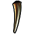
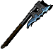
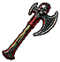
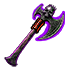
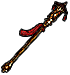
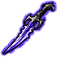
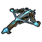
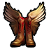

# Items

Legend: 

Yellow - Upgrade Item and who Upgrades

Green - Item complete

Teal - Needs description for next release

Italics - Description complete and editor approved

### Story Items

ZBeshpec

Eshpel. Usable by: PC

Requires: Act 3 - Amulet

Effects: Initial - Constant Effect: Non-Detection.

After Upgrades - Teleport to the Pits of Despair.

Description:

ZBpagesC

        Report from the Shadow Thieves  
Requires: Act 1 - Given to Player by Galen Bayle

Effects:

Description:

ZBsealsc

        The Mark of Thay

Requires: Act 4

Effects: Allows the opening of the Swamp Tower outer door to enter Outer Swamp Area

Description:

ZBnecroc

        Necromantic Seal

Requires: Act 4

Effects: Allows the opening of the Swamp Tower upper floors to enter the Sanctum of Szass Tam

Description:

Zbangwic

Angel Wings

Requires: Act 3 - Match - Devas

Effect: Used to upgrade the Golden Gale to the Seraphic Gale

Description:

Zbribbc

        Magical RIbbon

Requires: Act 2 - Match 15 J  
Effect: Used to upgrade the Jade Fury to the Jade Spindel

Zbuskulc

        Unique Skull

Requires: Act 3 - Match 17 - Demilichs

Effect: Used to upgrade the Blood of Orcus to the Corrupted Blood of Orcus

Zbdlfac  
        Dracolich Fang  
Requires: Act 4 - Killing Deathslither

Effect: Used to upgrade Nephetel’s Penumbral Dagger to the Umbral Dagger

### Weapons

        Festering Maw +3, Usable by:

Requires: 9500 Gold

Effects: 1d10 Piercing/Slashing +3, +1d4 Poison, Save vs Spell -2 to Disease. Slow effect and 1 poison damage for 2 rounds

Description: Forged by the lizardfolk shamans of the Mere of Dead Men, this grotesque weapon has passed from one sovereign of the Slavering Maw clan to the next, its blade anointed in the blood of those too weak to rule. The halberd’s jagged blade is coated in old bloodstains and dark patina that glows brightly under the lightless sky of the dark moon. Clan lore holds that the blade remembers every life taken, and grows sharper for each. How this weapon that even most lizardfolk dread to touch left the Mere is unknown, though its presence in the realms is rarely subtle. The Festering Maw announces itself in the bodies it leaves behind, rotting from wounds that should not fester. Healers weep in the face of this sickness that resists their prayers, while wiser tongues suggest the weapon was never meant for battle alone, but as the shadow that a savage ruler can cast.

Zbgrimsc

        Grimsaw +5, Usable by: All

Requires: Match 18

Effects: Grimsaw. Dagger +5, +4 piercing damage Ability: Fishhook 3/day targeted enemy is pulled toward wielder, stunning for 1 round, save vs death -6(?), deals 4d6+4 piercing damage  
Upon a successful Backstab applies "Gut" -4 to AC for 4 rounds

Description: A weapon of a vicious pirate captain lost to the waves of Umberlee during a storm. May have gotten some powers from underwater creatures like Kuo-Toa or Sahguain

Zbmastc  
        Mastadon +3, Usable by: Any

Requires: 10000 Gold

Effects: Base 1d12 + 2 cold damage, 25% Chance to knock opponent Prone (Save vs Death -1) for 1 round. If Barbarian +1 Con. Ability: Trumpet 2/day (AOE 30 feet +1 to THAC0/Damage).

Description: Born from the cold plains of the Icewind Dale. A barbarian chief carried this and his steps thundered like the wooly mammoth and he could inspire his whole tribe to war with its trumpet.

ZBorcusC

        Blood of Orcus +3. Usable by Evil

Requires:

Effects: +1 fire damage on hit, 4% chance it reduces HP by 20% (bone shatter), may cast Circle of Bones twice per day

Description: [https://forgottenrealms.fandom.com/wiki/Orcus](https://www.google.com/url?q=https://forgottenrealms.fandom.com/wiki/Orcus&sa=D&source=editors&ust=1776534064638681&usg=AOvVaw1e9d6hhkfDv9zzodsK-w9f) Orcus is the demon prince of undead. Bathed in the blood of Orcus by a vile member of a classically evil race it was made to battle those that get in their master’s way.

ZBggaleC

Golden Gale +3 (Spear). Usable by: Paladin, Fighter, Ranger

Requires:

Effects: Parry 1 attack per round. Does x2 attacks against the creature of the parried attack.

Description: A unique glaive from a far off land (perhaps Kara-Tur) that a master fighter wielded to hold off hundreds in a standoff against his home (a mountaintop sanctuary or some other mystical retreat per Chinese/Japanese lore). Seraphic Gale goes on to showcase how it is blessed by the wind god.

ZBsgaleC CRAFTED - Cespenar

        Seraphic Gale +6. Usable by: Paladin, Fighter, Ranger

Requires: Golden Gale, 15,000 GP, Angelic Wings

Effects: Parry 1 attack per round. Does x2 attacks against the creature of the parried attack. Equipped Special: Bathed in Gold - Gives +3 AC, Regen 2 HP a Round, uses gold bless BAM effect.

Description:

ZBstofdC

Staff of Disruption +2. Usable by: Any

Requires: 8500 Gold

Effects: Clone of Mace of Disruption.

Description: A cousin of the more well-known mace of disruption, this ornate staff is the invention of Thulsmine Achenfell, an aspirant necromancer from the Great Dale that sought to raise an undead army from within the Rawlinswood. His ambition proved his folly, however, as his would-be servants proved too unwieldy for him to control. The hoard turned against its master, spreading through the forest and forcing Thulsmine into a shameful retreat.

Embittered by the experience, Thulsmine found his true calling when he began crafting a weapon that could fix his mistake—not out of a desire to right any wrongs, but to simply remove any evidence of his incompetence. With this, the first staff of disruption was born. So effective it was at the eradication of his undead creations that Thulsmine lost himself in the experience—quite literally. His spellbook in tatters and his undead army naught but dust, the wizard wandered the Rawlinswood until his untimely demise, perishing alone in the very woods he had once sought to conquer.

It is unlikely that this staff is the same one that Thulsmine wielded, but it carries his legacy nonetheless. Infused with the same disruptive power, it still hums with the magic he used to undo his creations.

zbtnbowc

Thornbow +5 Usable by: Any

Requires:

Effects: Poison Resistance 50%, 1d6+5 + 5 poison, Once per Round on hit Thorn Spray (no friendly fire). Causes 10 piercing damage equipping the item.

Description[[a]](#cmnt1): Made by a mad druid for his friend a ranger to fight off those that would invade a Circle of Druids that was falling to Shadow Druids or some other force. It has taken so much blood from those that have picked it up perhaps it is starting to corrupt.

**QUEST ITEM**

ZBjadefC

        Jade Spindle. Usable by: All but Cleric (multiclass)

Requires:

Effects: Throwing Dagger +4, Base APR 2, Damage 1d4+4, +2 Acid Damage, 15% Lesser Flurry once every 4 attacks. Lesser Flurry: +2 APR for 1 Round, cannot trigger Lesser Flurry for 2 Rounds

Description:

ZBjadefC and ZBjadeui CRAFTED - Mouf

Jade Spindle. Usable by: All but Cleric

Requires: Jade Fury, Firetooth Dagger, 15000 Gold

Effects: Throwing Dagger +5, Base APR 2, Damage 1d4+5, +4 Acid Damage, +1 Fire Damage, 10% chance to do 1d6 Fire Damage, 15% chance Fire Shield (Acid) 4 rounds, 30% chance Greater Flurry. Greater Flurry: +2 APR for 2 Rounds, cannot Trigger Greater Flurry for 3 Rounds.

Description:

ZBkraktC

        Kraken’s Toothpick. Unusable by: Cleric (multiclass), Mage, Sorcerer, Thief, Bard, Shaman

Requires:

Effects: Great Axe (Base 2d6) +5 (Two-handed) +4 Cold damage. Upon receiving hit Water Shield (uptime ⅔ the time).

Description:

ZBcelescC

        Celeste +4 . Usable by Bard, Thief, Mage, Sorcerer.

Requires:

Effects: Sentient Weapon

Description:

ZBriptiC

        Riptide +5. Usable by. All but Mage, Sorcerer, Druid, Shaman, Beastmaster, Cleric (multi-class).

Requires:

Effects: Katana +5, +4 cold damage. 50% Cold Resistance. On hit 50% chance of 1 stack Tidal Wave. Every 4 stacks of Tidal Wave casts (stronger) Smashing Wave on target.

Description:

ZBafistC

        Angelfist +5. Not usable by: Mage, Sorcerer.

Requires: Killing the “Winged”

Effects: Warhammer +5, +4 fire damage. On hit 50% chance 1 stack of Flame Wings. Flame Wings: -10% Fire Resistance per stack lasts 4 rounds. Max Stacks 4. Heavenly Hammer: 1/day. Instant Cast Firestorm

Description: When wielded, this warhammer glows with a soft ethereal light of Elysium... warm, comforting, yet with a hard edge of righteousness. Being struck feels the same, but with condemnation for the faithless. Its name is Angelfist, and it is quickly apparent the preferred answer to most questions is unleashing divine fury.

ZBprofaC

Profane +4. Usable by Evil:

Requires: Killing Deathslither

Effects: 50% Acid Resistance, Acidic: Every hit has a 15% has a chance to deal additional acid 2d8 damage Poisoned: Target suffers 1 poison damage per second for 24 seconds (Save vs. Death at +2 penalty negates), and also immediately suffers 6 poison damage (no save). Unholy: Every hit has a 15% chance to deal additional effects of Unholy Blight (6d8).

ZBlunarC

        Lunar Scythe +5 (staff). Usable by: Ranger, Druid, Shaman

Requires:

Effects: 1d8+5 +(moonblade) damage. Casts Lunar Phase (custom moonwall effect) 1/day. 2 APR, On hit Moonburst (sunray) with moon damage and aoe healing, once every 2-3 rounds.

Description:

Zbcatcoc

        Catacomb (staff or wand). Usable by: Mage, Sorcerer

Requires:l

Effects: 1/day Animate Dead (Level 16), 1/day Summon Servant of Orcus (Death Knight)

Description:

Zbplanec

        Planestalker (1h Sword). Usable by:

Requires:

Effects:

Description:

ZBdgflyc

        Dragonfly (dart). Usable by: All

Requirements - Match 8 - Saughain

Effects: Dart +4, Poison Resistance: 50%, Free Action, Insect Plague on Hit.  

Description:

ZBgneedc

Golden Needle. Usable by: All except Mage, Sorcerer, Cleric (multi), Shaman?

Requirements: 12500 Gold

Effects: Shortsword +4, +1 Crushing, Slashing, Piercing AC

Description:

ZBbanefc

        Banefire Scepter. Usable by: All Evil

Requires:

Effects:  Casts Banefire 3/day. Banefire: Black and emerald fire that jumps from one enemy up to 3x to the next, each time losing 1/3 damage dice (7d8, 3d8). Deals 10d8+20 damage. Deals magic damage that also applies Doom spell (no save) and physically Crippling (-4 vs Death) -3 Str/Dex for 1 Turn.

Description:

### Armor

ZBbarmC

        Dragonbone Armor. Not usable by Good.

Requires:

Effects:

Description:

ZBngrifc.bam

        Night Griffon Armor. Usable by Fighter, Cleric, Ranger, Paladin,

Requires:

Effects:

Description:

ZBcorviC

        Corvid Breastplate +5. Not usable by Mage, Sorcerer.

Requires:

Effects:

Description:

ZBstandC

        Standing Ovation +5 (Studded Leather). Usable by Bard.

Requires:

Effects: Base AC is chain (5) - Total AC = 0. +2 to Save vs Breath, 10% Phys Resistance. Extends Bard Song Duration by 2 rounds. Upon killing an opponent receive the “Adulation” buff. Adulation gives +3 THAC0, +3 to all Saves, +3 to Damage. Lasts 3 rounds.

Description:

ZBredroc

        Red Robe of Thay. Usable by Mage, Sorcerer

Requires: BOSS - Viktor the Spider

Effects: Base AC: 3, +1 Cast Speed, +20% MR, Immunity to Horrid Wilting, +25% damage to elemental and magic spells.

Description:

### Accessories

ZBkeyriC

        Keyring. Usable by: Any

Requires: 9000gp at BP2 Ziks merchant

Effects: 100% Find Traps, Open Locks 3x/day.

Description: This plain brass ring is unassuming without engraving or apparent magical properties. When slipped from your finger, it transforms into a keyring adorned with an assortment of golden keys that hum with latent power.

Whoever crafted this masterwork was as careful to hide themselves as their creation, but they certainly had access to an implausible number of skeleton keys, and it is unlikely this ring was not involved in many an 'impossible' heist.

ZBrrrinC

        Resplendent Ruby Ring. Usable by: Any

Requires: Given with Vytari’s Note by Mysterious Messenger

Effects: +1 AC, +1 to all Saves,

Description: Sometimes called “The Hopeful” among the Red Wizards of Thay, these modest rings are set with small, dull rubies and issued to agents in far away lands bound for unpleasant assignments. It is said the first of such rings appeared around 1200 DR, handed out by junior Zulkirs eager to shore up the nerves of far-flung messengers and expendable spies.

Though the enchantment is notable, few recipients have kept them for long, for more often than not their dead bodies have washed up in unwelcome locales with only the ruby ring and a weathered letter as evidence of their identity. In Thay, to accept such a ring is seen as a mixed blessing: they are undeniably useful, but oft serve as an omen that one’s usefulness is nearly at its end.

ZBgotb1C

        Gloves of the Shifter. Usable by: Druid.

Requires:

Effects:

Description:

ZBlbootc

        Luxurious Lizardskin Leaps, Usable by: Any

Requires: Match 3 - Lizardmen

Effects: +2 Cha, 30% Fire Resistance, +1 Breath Weapon Save, “Leap” x2 day. Leap teleports the user 30’ via a Dimension Door ability.

Description: Many beasts of fable prowl the jungles of Chult, but these elegant boots are one of a kind, fashioned from the thick verdant hide of a great lizard said to roam the deepest reaches of the wilds. The creature was legendary for its uncanny evasiveness. Despite being a lumbering behemoth whose scales could be seen glistening from a hundred feet away, it eluded capture and study for nearly a century, its magical leap carrying it beyond the reach of countless hunters and curious students.

When the noble-born sorcerer and hunter of exotic beasts Khuldros Vey of Tethyr finally brought the beast down through cunning traps and cruel magics, he commissioned these lavish boots as a testament to his triumph—or, as his naysayers would tell it, to his atrocity. Those who wear these boots find themselves gifted with a remnant of the creature’s power—though always with the uneasy knowledge that something sacred was destroyed in their creation.

Zbshamc

        Dancer’s Shoes. Usable by: Shaman  
Requires: 18000 Gold

Effects: AC/Saves +2, Spirits gain +1APR, +4 Damage, 10% Phys Resist. Ability 1/day - Mass Contagion: Chain attack that hits 1 then to the next in a 40 ft radius up to 5 targets. Poisons Damage 4/round. -4 AC/Saving throw, -2 THAC0). Save vs Death -2 to avoid. Duration 5 rounds.

Description:

ZBskyhaC

        Skyhammer Gauntlets. Usable by:

Requires:

Effects:

Description:

zbpsyC

        Psyche (Amulet). Usable by: Any

Requires:

Effects: +5% MR, can cast "Joy" x2 a day. Joy is a combined Emotion: Hope and Emotion: Courage from IWD.

When hit causes "Despair" giving the one who hit them -2 to THAC0 (Non-stacking)

When attacks can give "Anger" those hit lose -2 to AC (non-stacking).

After a kill has "Remorse" which causes 1 round of temporary loss of Anger and Despair.

When hit causes”Fear” 1 per round limit. Causes root, -2 to Saves, +2 AC. Save vs death -4 to avoid the effect.

Description:

ZBdkbelC

        Dark Knight Belt. Usable by: Any

Requires: 12,500 Gold

Effects: Immune to Poison +1 AC, +1 Saving Throws 25% cast Glitterdust on in 15’ Radius each round, only usable every 4 rounds. If Thief (multiclass) or Bard an additional +1 AC/Saving Throw.

Description:

ZBbruinC CRAFTED - Cromwell

        Belt of Ruinous Rage. Usable by Barbarian

Requires: 12,000 Gold  
Effects: +3 Piercing and Missile AC. Transforms a Barbarian's Rage into 'Ruinous Rage' which causes

all attacks to do 1d6+3 slashing damage if 1-handed or 1d10+3 if 2-handed in a 5' radius around the target hit. Also causes 1d4 slashing per round damage to the Barbarian who is raging.

Description:

ZBtnskyC

        The Night Sky. Usable by Mage, Sorcerer, Cleric (multiclass).

Requires: Match 6 - Vampires

Effects: Enemies suffer -2 save vs Necromancy school spells./sc

Description:

ZBwhispc

Parade of Darkness (cloak). Usable by

Requires:

Effects:

Description:

ZBbearfC CRAFTED - Cromwell        

Bearfoot. Usable by: Barbarian, Ranger, Cleric, Shaman

Requires: The Frost’s Embrace, Talos’s Gift, 7,500 gp

Effects: +50% Cold Resistance, +50 Electric Resistance. +1 AC

Description:

ZBviridC

        Viridian Mask. Usable by: Any

Requires: 10,000 GP

Effects: +1 AC, Immunity to Charm and Stun effects.

Description:

ZBvirilC  CRAFTED - Cromwell

        The Viridian Lord. Usable by: Any

Requires: Viridian Mask, Helm of Glory, 10,000 gp

Effects: +1 AC, +2 Crushing AC, Immunity to Charm and Stun Effects. +2 Cha. Protects from Critical Hits.

Description:

ZBbbullc

        Blazing Bull. Usable by: Fighter, Cleric(multi)

Requires: Match 2 - Minotaur and Thieves

Effects: +1 AC, +5% Phys Resist, Protects from Crit Hits, Provides Flaming Gore attack 1 per round. 1d6 physical +2 Fire damage (no Strength). If Barbarian damage is increased to 2d6 + 4 Fire (no Strength)

Description: This helmet was once the prized possession of Ragath Flame-Caller, a barbarian chieftain whose fury burned so hot that it was said to melt the snow of the frozen tundra he inhabited. Forged from the iron-cast skull of a minotaur he felled in single combat, the Blazing Bull was both a trophy and a warning, the eyes a reflection of the pyres Ragath left smoldering in his wake. Those who faced him in combat swore they could feel the heat of the bloody helmet long before his axe ever cleaved flesh.

Ragath’s conquest ended at the hands of betrayal—a trusted ally, driven by fear of the chieftain’s growing power, struck him down as he slept. The Blazing Bull was fearfully discarded into the icy rapids and lost… if only for a time. Even now, its heat is undimmed by the elements and the passage of years, though not everyone possesses the will to tame its strength.

ZBgrummc

        Grummsh Totem (quickslot item) Usable by: All

Requires: Match 1 - Orcs

Effects: Usable 2x a day, casts Berserker Rage for 2 turns

Description: Among the Ashmaw clan—a powerful but relatively secretive clan of orcs that once lived amongst the Sunset Mountains—the most devout servants of Gruumsh were not allowed to fall into obscurity. Death was seen as merely a threshold, and the greatest of their warriors, shamans, and chieftains were not left to decay in the frozen reaches of their homeland. Instead, their heads were severed in grizzly rituals, dried in the smoke of pinewood fires, and then serenaded in the name of Grummsh.

Fashioned into easily carryable totems by shamanic magic, they were oft brought into battle by the fiercest of the Ashmaw, who sought both the wisdom and fury of their ancestors. Clutching the totem was said to awaken the rage of the dead, flooding the wielder with visions of fury and bloodshed, goading them into a battle frenzy.

The wooden talisman depicts heads that bear the markings of battle-scarred warriors, the eyes appearing to watch those that hold it, and mouths caught in voracious smiles.

ZBmmaskc

        Mirror Mask. Usable by: All

Requires:

Effects: Immunity vs Gaze attacks (like those of Vampires, Umber Hulks, Basilisks etc), Mirror Image (Caster Level 10) 2x /day

Description: This peculiar mask was the prized possession of a Calishite illusionist named Qhari, who never allowed herself to be seen by others without it adorning her face. There were many rumors as to why she wore the mask, but the most prevalent tells the tale of Qhari creating the mask after an encounter with a medusa in the Cloud Peaks forced her to blind herself. Rather than seek healing, it is said she retreated into seclusion, only to reemerge with her sight restored and the Mirror Mask upon her face.

Detractors of this story often point out that deliberately blinding oneself is a drastic course of action opposed to simply averting one’s gaze, but the truth is a tale that has been lost to time, leaving only legends in its place. Despite its rigid appearance, the mask molds perfectly to the wearer’s face, obscuring their features almost entirely while reflecting the world back in distorted fragments.

ZBuneckC

        Unbroken. Usable by: Any

Requires:

Effects: +1 Con, +10% MR, Cast Freedom x1 per day, Immunity to Maze and Imprisonment

Description:

ZBfenriC

        Fenris. Usable by: Neutral

Requires:

Effects:

Description:

ZBeotb1C

        Beholder. Usable by: Any.

Requires:

Effects: Constant effect of Seven Eyes.

Description:

ZBsolarC

        Solar Flare: Usable by Any Good.

Requires:

Effects: +40% Fire Resistance, Casts Heavenly Inferno 1/day, Casts Sunscorch (Level 20) once every 2 rounds on hit from a weapon.

Description:

ZBdupliC

        Duplicity. Usable by: Any.

Requires: Match 9 - Martii

Effects: 50% chance for 125% fire resistance for 1 round, 50% chance for 125% cold resistance for 1 round. Every round it has cold resistance it fires a pure flame bolt (fire arrow) at the nearest enemy within 30 ft for 3d6 fire damage (no MR), or when you have fire resistance a pure cold bolt, 3d6 cold damage (no MR).

Description:

ZBjacktC

        Jack, Of All Trades (cloak). Usable by: Any Requires: Match 6 - Vampires Effects: Each class or multiclass receives the following different abilities.

Sorcerer Full: One additional 4th and 5th spell slot [Completed]

Druid Full: Regen 1 HP/round, 10% Elemental Resist [Completed]

Druid Partial : Regent 1 HP/3 rounds, 5% Elemental Resist [Completed]

Cleric full: +2 Casting Speed, +2 Save VS. Death [Completed]

Cleric Partial: +1 Casting Speed, +1 Save VS Death  [Completed]

Thief Full: +1 THAC0, +1 Dex, 5% Thieving skills [Completed]

Thief Partial: +1 Dex, 5% Thieving skills  [Completed]

Mage Full: 10% Elemental/ Magical Resistance, +2 Save VS spell  [Completed]

Mage Partial: +5% Elemental/Magical Resistance, +1 Save VS Spell  [Unused]

Fighter Full: +1 Con, 5% Physical Resistance, 5% Magic Damage Resistance  [Completed]

Fighter Partial: +1 Con, 5% Physical Resistance  [Unused]

Ranger: Fighter Full, Druid Partial, Thief Partial [Completed]

Shaman: Sorcerer Full, Druid Full. [Completed]

Paladin: Full Fighter, Cleric Partial [Completed]

Monk: Fighter Full, Thief Partial [Completed]

Bard: Fighter Partial, Thief Full, Mage Full  [Completed]

Multiclass: Full benefit from classes  [Completed]

Description: Both the creator and previous owners of this peculiar cloak, much like the garment itself, have been largely lost to history. Whether ‘Jack’ was once its wearer or simply a namesake is unclear, but whoever they were, the cloak has long outlasted them.

The earliest surviving record of the cloak appears in a merchant ledger from Berdusk, where it was listed in its inventory before disappearing entirely. In the years since, it has surfaced in tales of a duelist in Riatavin who swore it gave him the reflexes of a cat, and a mage living in the Sunset Mountains who claimed it helped her survive the harsh environments.

The cloak adjusts itself from owner to owner—the seams shift, colors blur, and the weight in the hem seems to come and go. It attunes itself to the wearer and their needs, and sits snugly as though it were designed for them alone. It offers just enough to make them feel exceptional—but never quite enough to make it feel like theirs.

Most who wear it accomplish great things, though few keep it for long.

ZBdiaboC

        Diaboliq. Usable by: Any Evil

Requires:

Effects:

Description:

ZBahorsc

        Angelic Horseshoe. Usable by: Any Good

Effects: Charisma: +1, Constitution: +1, Luck: +1, Movespeed +6

Description: Only four of these magnificent golden horseshoe amulets are known to exist.  According to legend, they once belonged to an astral deva who liked to polymorph herself into an equine form such as a pegasus or unicorn when on a mission in the prime material plane, often serving as the mount of a worthy hero.  During one perilous mission the deva's avatar was slain and the grieving heroes kept her horseshoes as a memento and lucky charm.

ZBdmaskc

        Mask of Deception. Usable by:

Requires:

Effects:

Description:

ZBsotfc

        Sign of the Fist. Usable by: Monk

Requires:

Effects:

Description:

ZBcranec

        Crane Wraps. Usable by: Monk

Requires:

Effects: Allows monks x2 Backstab Modifier

Description:

## NPC Items

ZBtwdagC

        Umbral Fang. Usable by Nephetel.

Requires: Recruit Nephetel

Effects: Equipped abilities:

– Immunity to instant-death effects, paralysis, hold, and level drain

– +60% resistance to cold

Combat abilities:

– 10% chance per hit of inflicting Grave Chill on the target, causing 1d4 cold damage instantly, and again once per round in the next 3 rounds. If a save vs. Death is failed, the target is Held for 1 round, otherwise, they are only Slowed

– Critical hits unleash a ray of necromantic magic into the body of the victim, forcing them to save vs. Death or die. If the target has 60 hit points or less, the save vs. Death is made at -4. Even if a save is made, they still suffer 2d6 magic damage from the shock

– +5% chance to critically hit (this weapon only)

Charge abilities:

– Lich's Essence once per day

  Special: Protect against the effects of spell levels 1-5 for 1 turn

  Area of Effect: Self

Description: Gleams with a ghostly sheen that radiates a powerful chill as if from the grave. Contains the essence of a long destroyed lich (or Dracolich) that belonged to the Cult of the Dragon. Its construction is rumored to be, at least partially, the fang of one of the great beasts. Upgraded from the fang of Deathslither, the dracolich, it may tell his story more than anything else.

Zbaxbowc

        Astral Crossbow of Speed

Requires:

Effects:

Description: Constructed by an inventive gnome from the Church of Gond, this crossbow is a mechanical marvel. Able to harness energies from the Astral Plane it fires those energies that causes greater harm those from the outer planes.

  
Upgraded from a sprout from the Tree of Life in Suldanessellar it transforms the energy it can capture into pure life energy that will etherealize where the bolt is fired causing a portion of what it hits to disintegrate.

Zb9livec

        Nine Lives. Usable by any who can use Studded Leather.

Requires:

Effects: Cheat Death HLA x4 Charges

Description: Armor of this style was once common among the more militant worshippers of Sharess, a goddess whose followers prefer the pleasures of festhalls to honor their feline lady rather than kneel in a temple. In 1311 DR, a sect known as the Velvet Claw adopted the stark white studded leather, its color symbolizing the purity of joy and the confidence of a predator without need of camouflage. The sect served as both protectors of their festhalls and escorts for wealthy patrons traveling between city-states, earning a reputation for their grace and the uncanny habit of landing on their feet, no matter the fall.

Over time the armor fell out of use and remaining sets were quickly found in pawnshops, likely to pay off the substantial debts that a Sharess-worshiper is likely to accrue. Those who possess the armor today are unlikely to ever rid themselves of it due to the life-saving enchantments, leading the sets to become highly valued across the Realms.

ZBumbrac

        Strange Silver Ring. Usable by: Any

Requires:

Effects:

Description: Forged by a githyanki smith from the same silver as silver swords, it is a highly magical and mysterious artifact that the githyanki want to recover as much as a silver sword.

Zbpdbrc

        The Supple Touch. Usable by: Nephetel

Requires:

Effects:

Description: These gloves were given to Nephetel when she was first inducted into the Thieves Guild. While they were supposedly not magical, it seems that her deeds have over time imbued them with a certain power, which reflect the owner's skills. These gloves fit snugly around her hands, and are made of a soft, supple leather that is surprisingly durable. They are unadorned, save for a small, stylized 'N' on the back of each hand. They are well-worn, but have been meticulously cared for, and show no signs of wear. Because of this adaptation to her, only she may wear them.

ZBbbookc

        The Pits of Despair: Desperate and True by Baeloth Barrityl Dictated but not read

Effects:  
Description:

Baeloth Barrityl, the notorious drow sorcerer and self-proclaimed "Entertainer" has once again unleashed his literary prowess upon the unsuspecting masses. His latest work, The Pits of Despair: Desperate and True, is a rousing mix of drama, despair, and – as one might expect – a rather excessive amount of self-aggrandizement.

However, there are moments in which Barrityl’s over-the-top style gets the best of him. The prose often veers into the theatrical—though, given that this is a work by a drow sorcerer, this is perhaps to be expected. The narrative is occasionally interrupted by lengthy monologues that read as though they were lifted directly from one of Barrityl's own performances, making it unclear whether the book is a story or simply a vehicle for Barrityl’s self-promotion. One could imagine him standing on a stage, flourishing dramatically as he dictates each word with an exaggerated flourish. If you enjoy the sound of your own voice (or, in this case, the written word) more than the development of characters and plot, this might suit your taste.

In conclusion, The Pits of Despair: Desperate and True is a book that will divide its audience. Some will find it a masterpiece of bleak, brooding storytelling—an ode to the complexities of the soul and the burdens of heroism. Others will be turned off by its heavy-handed melodrama and self-indulgent prose. Still, as a work dictated by Baeloth Barrityl himself, it is undeniably fascinating and worthy of attention, if only for its sheer audacity and bravado. Whether or not you emerge from the pits of despair with any sense of hope is a matter for each reader to decide.

Rating: ★★★☆☆ (3/5 stars)

A work of considerable ambition, but ultimately, one that may leave you feeling more exhausted than enlightened.

## Cespy Upgrade Items

ZBsntabC

Scarlet Ninja Tabi. Usable by: Monk, Thief, Bard

Requires: Ninjato of the Scarlet Brotherhood, 10,000 Gold

Effects: +1 APR, Movement Speed Buff of Boots of Speed

Description:

ZBtopalC

The Open Palm. Not usable by: Mage, Sorcerer, Thief, Bard, Shaman

Requires: Kundane, Shield of Order, 5,000 Gold

Effects: Large Shield, +0.5 APR, +3 AC

Description:

ZBshelmC

        Spirit Dragon Helm. Not usable by Mage, Sorcerer, Thief, Bard.

Requires: Helm of Charm Protection, Dragon Helm, 10,000 Gold

Effects: Immune to Charm, Dominate. +2 AC, +2 Saving Throws, +40% Fire/Cold/Electricity/Acid/Poison, Protection from Critical Hits.

Description:

ZBwingbC

        Winged Boots. Usable by: Any

Requires: Belm, Senses of the Cat, 10,000 Gold

Effects: +0.5 APR, SCS Flight Immunities (Grease, etc), Movement Speed Doubled, +4 vs Missile AC.

Description:

ZBskinrC

        Robe of Skin. Usable by: Monk

Requires: Body of Balthazar, one of a Robe of the Good, Evil, or Neutral Archmagi, 10,000 Gold

Effects: Endgame Monk Armor

Description:

ZBsbootC

        Silent as Stone. Usable by: Any

Requires: Worn Whispers, Gargoyle Boots, 15,000 Gold

Effects: AC+1, +20% MS, +15 HiS, Cast Stoneskin 2/day, 15% chance per hit cast Improved Invisibility for 4 rounds. Can only occur if it doesn't have the improved invisibility effect.

Description:

Requires:

Effects:

Description:

Requires:

Effects:

Description:

## Spell-like Icons and Effects

ZBlfluri        Lesser Flurry

ZBgfluri        Greater Flurry

ZBhvnhai        Heavenly Hammer

ZBflamwi        Flame Wings

ZBrbless        Red Bless effect effect

ZBacshdp        Acid Shield Portrait

ZBwtshdp        Water Shield Portrait

ZBdvshdp        Divine Shield Portrait

ZBacshds        Acid Shield spell effect

ZBwtshds        Water Shield spell effect

ZBdvshds        Divine Shield spell effect

ZBacshdi        Acid Shield Icon

ZBwtshd        Divine Shield Icon

ZBdvshdi        Water Shield Icon

ZBttpodi        Teleport to the Pits of Despair

Zbwittyi        Witty Jab Icon

# Spells

[[a]](#cmnt_ref1)bows don't usually have a damage bonus unless they're composite (+1 damage) in BG2EE. Perhaps we should discuss this. +5 poison seems fine to me though